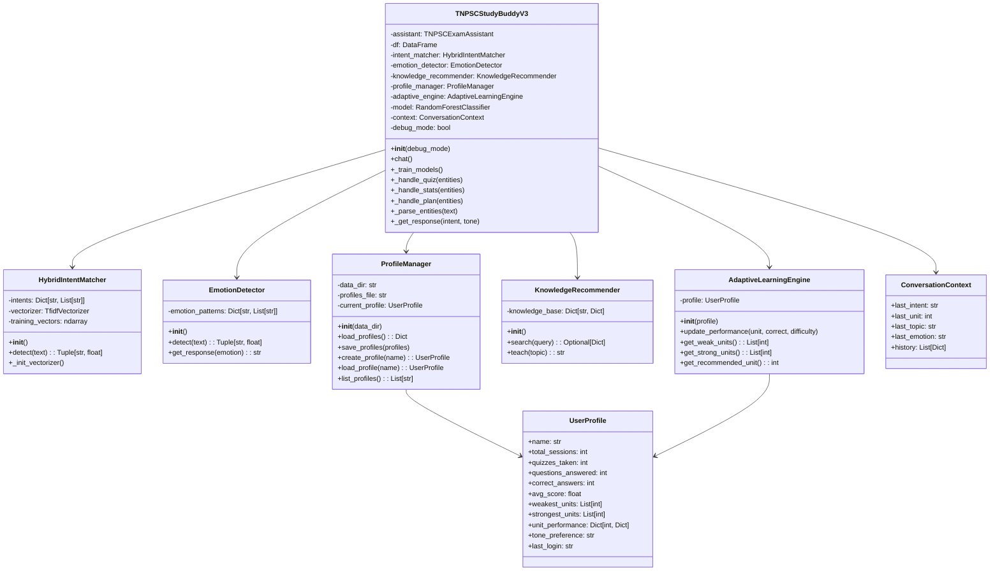
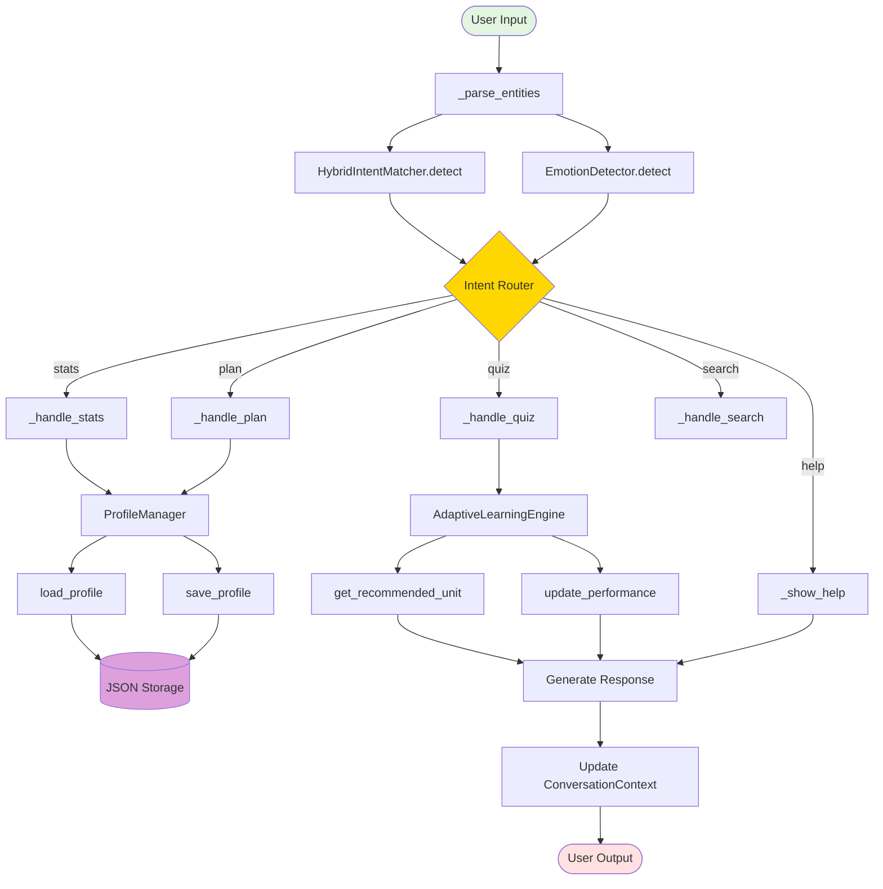
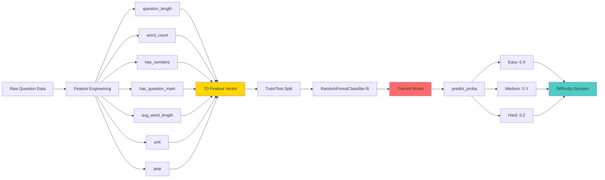
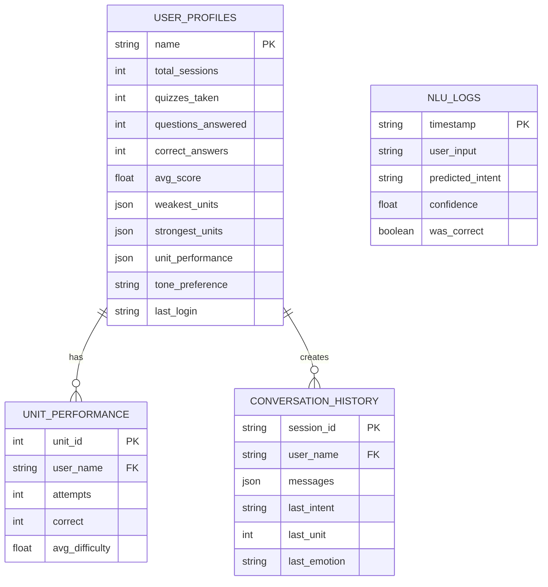
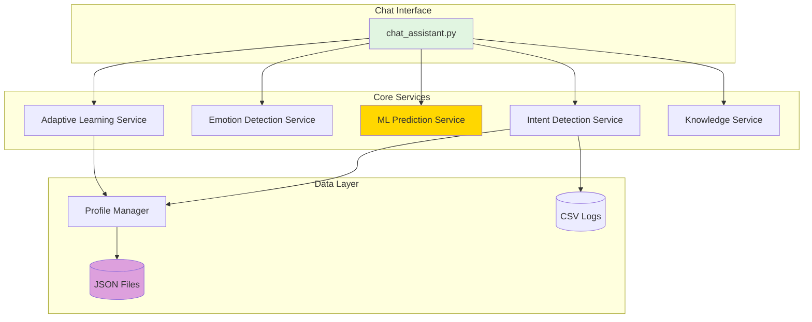
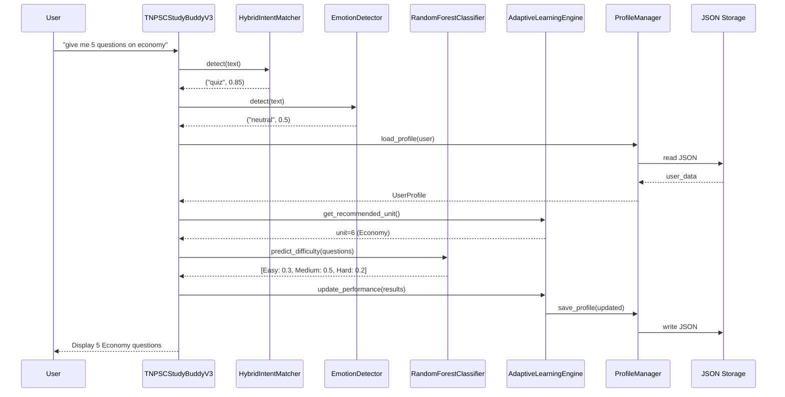
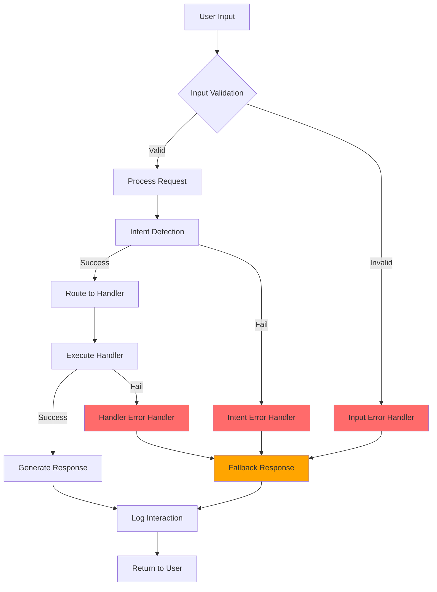
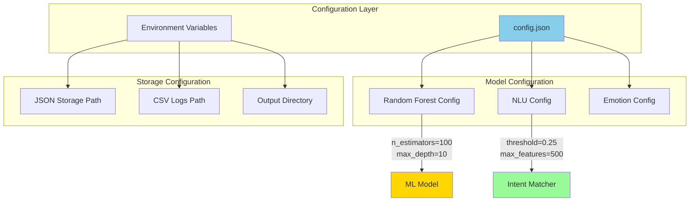
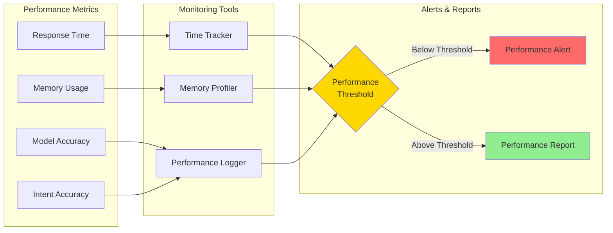
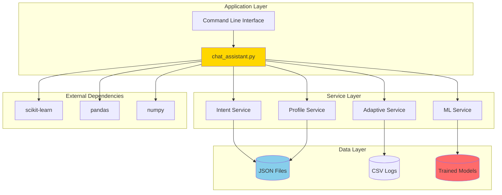

# 🏗️ TNPSC Study Buddy Backend - Mermaid Architecture

## **Backend System Architecture for chat_assistant.py**

---

## **1️⃣ BACKEND CLASS ARCHITECTURE**

---

## **2️⃣ BACKEND DATA FLOW**

---

## **3️⃣ ML MODEL BACKEND PIPELINE**

---

## **4️⃣ BACKEND STORAGE ARCHITECTURE**

---

## **5️⃣ BACKEND API ENDPOINTS (Conceptual)**

---

## **6️⃣ BACKEND PROCESSING SEQUENCE**

---

## **7️⃣ BACKEND ERROR HANDLING**

---

## **8️⃣ BACKEND CONFIGURATION**

---

## **9️⃣ BACKEND PERFORMANCE MONITORING**

---

## **🔟 BACKEND DEPLOYMENT ARCHITECTURE**

---

## **📊 BACKEND TECHNICAL SPECIFICATIONS**

### **Core Components:**
- **Main Class**: `TNPSCStudyBuddyV3`
- **ML Engine**: Random Forest (100 estimators)
- **NLU Engine**: TF-IDF + Cosine Similarity
- **Storage**: JSON-based persistence
- **Context**: Conversation memory management

### **Performance Targets:**
- **Response Time**: < 1 second
- **Memory Usage**: < 100MB
- **Model Accuracy**: > 85%
- **Intent Accuracy**: > 90%

### **Scalability:**
- **Single User**: Current implementation
- **Multi User**: Profile-based separation
- **Concurrent**: Thread-safe operations
- **Storage**: File-based (JSON/CSV)

### **Dependencies:**
- **Python**: 3.8+
- **scikit-learn**: ML algorithms
- **pandas**: Data manipulation
- **numpy**: Numerical operations
- **JSON**: Data persistence

---

**This backend architecture supports the complete TNPSC Study Buddy system with adaptive learning, emotion detection, and personalized user experiences.**