# 🏗️ Improved Backend Block Diagram

## **TNPSC Study Buddy - Enhanced Backend Architecture**

```mermaid
flowchart LR
    RawData[(� Raw uData<br/>TNPSC Questions)] --> DataLoad[🔄 Data Loading &<br/>Preprocessing]
    
    DataLoad --> Feature[⚙️ Feature Extraction<br/>• question_length<br/>• word_count<br/>• has_numbers]
    
    Feature --> Training[🎯 RandomForest<br/>Training<br/>n_estimators: 100]
    
    Training --> ModelArt[(🏆 Model<br/>Artifacts<br/>.pkl)]
    Training --> Viz[� Visulalizations<br/>• Accuracy<br/>• Loss<br/>• Confusion Matrix]
    
    UserInput[👤 User Input<br/>Quiz/Stats] --> PredApp[🔮 Prediction<br/>Application]
    
    ModelArt --> PredApp
    
    PredApp --> ChatBot[🤖 Chat Assistant<br/>Intent Recognition]
    
    ChatBot --> Output[📱 Output<br/>Quiz/Plans/Stats]
    
    %% Styling
    style RawData fill:#8B4513,color:#fff
    style DataLoad fill:#4682B4,color:#fff
    style Feature fill:#4682B4,color:#fff
    style Training fill:#FFD700,color:#000
    style ModelArt fill:#DEB887,color:#000
    style Viz fill:#90EE90,color:#000
    style UserInput fill:#DDA0DD,color:#000
    style PredApp fill:#FF69B4,color:#fff
    style ChatBot fill:#4682B4,color:#fff
    style Output fill:#90EE90,color:#000
```

---

## **Alternative Vertical Flow**

---

## **Horizontal Pipeline Style**

---

## **Clean Component View**

---

## **Alternative Simple View**

---

## **Super Simple Version**

```mermaid
flowchart TD
    Input[📝 User Question] 
    --> Process[⚙️ AI Processing]
    --> Generate[🎯 Smart Response]
    --> Save[💾 Save Progress]
    --> Output[✅ Answer to User]
    
    style Input fill:#e1f5e1
    style Process fill:#ffd700
    style Generate fill:#ff6b6b
    style Output fill:#4ecdc4
```

---

## **Component Overview**

---

**Pick any of these simple diagrams for your presentation! 🎯**