# 🏗️ Simple Backend Block Diagram

## **TNPSC Study Buddy - Simple Backend Architecture**

```mermaid
flowchart TB
    User[👤 User Input] --> Interface[💬 Chat Interface]
    
    Interface --> Processing[🔧 Input Processing]
    
    Processing --> AI[🧠 AI Engine]
    
    AI --> ML[🤖 ML Model]
    AI --> Knowledge[📚 Knowledge Base]
    AI --> Profile[👤 User Profile]
    
    ML --> Prediction[📊 Difficulty Prediction]
    Knowledge --> Teaching[📖 Concept Teaching]
    Profile --> Personalization[🎯 Personalized Learning]
    
    Prediction --> Response[💭 Response Generation]
    Teaching --> Response
    Personalization --> Response
    
    Response --> Storage[💾 Data Storage]
    Response --> Output[📱 User Output]
    
    Storage --> Files[(📁 JSON Files)]
    
    style User fill:#e1f5e1
    style AI fill:#ffd700
    style ML fill:#ff6b6b
    style Output fill:#ffe1e1
    style Files fill:#dda0dd
```

---

## **Alternative Simple View**

---

## **Super Simple Version**

```mermaid
flowchart TD
    Input[📝 User Question] 
    --> Process[⚙️ AI Processing]
    --> Generate[🎯 Smart Response]
    --> Save[💾 Save Progress]
    --> Output[✅ Answer to User]
    
    style Input fill:#e1f5e1
    style Process fill:#ffd700
    style Generate fill:#ff6b6b
    style Output fill:#4ecdc4
```

---

## **Component Overview**

---

**Pick any of these simple diagrams for your presentation! 🎯**